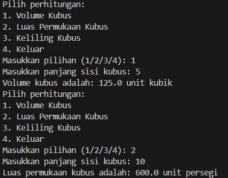

|  | Algorithm and Data Structure |
|--|--|
| NIM | 244107020097 |
| Nama | Tiara Febrianie |
| Kelas | TI - 1I |
| Repository | [link](https://github.com/tiara082/PraktikumALSD.git) |

# Java Project for Algorithm and Data Structure

This repository contains solutions for various algorithms and data structure problems in Java. Below is an explanation of the Java files included in the project.

## Files Overview

### 2.1.1 **calculateGrade.java**
   **Description**: This file implements a program to calculate the final grade and letter grade of a student based on scores for assignments, quizzes, mid-tests, and final tests.

   **Key Concepts**:
   - User input validation
   - Grade calculation based on weighted averages
   - Conversion from numeric grades to letter grades

   **Explanation**:  
   The program follows these steps:
   1. Input grades for assignment, quiz, mid-test, and final test.
   2. Validate if the grades are within the valid range (0-100).
   3. Calculate the average grade using a weighted formula:
      - 20% for assignment
      - 20% for quiz
      - 30% for mid-test
      - 30% for final test
   4. Convert the final numeric grade to a letter grade using predefined thresholds.
   
   **Output Example**:  
     

   
---

### 2.2.1 **evenNumber.java**
   **Description**: This file implements a program that uses a student's NIM (Nomor Induk Mahasiswa) to generate a sequence of numbers based on the last two digits of the NIM. The sequence excludes certain values and prints stars for odd numbers.

   **Key Concepts**:
   - String manipulation (substring)
   - Looping and control flow (if-else, continue)
   - User input handling
   - Conditional logic for sequence generation

   **Explanation**:  
   The program executes the following steps:
   1. The program accepts a student’s NIM (Nomor Induk Mahasiswa) as input.
   2. It extracts the last two digits of the NIM and treats them as a number.
   3. If the number is less than 10, it adds 10 to it.
   4. It then prints a sequence of numbers up to this number, with the following conditions:
      - Numbers 6 and 10 are skipped.
      - Odd numbers are replaced with a `*` symbol, while even numbers are printed as they are.

   **Output Example**:  
     

---

### 2.3.1 **CalculateIPSemester.java**
**Description**: This file calculates the semester GPA (IP Semester) by converting individual course grades into letter grades, calculating their weight, and computing the weighted average.

**Key Concepts**:
- Grade-to-letter conversion
- GPA calculation based on credit hours (SKS)
- Input validation and error handling

**Explanation**:  
The program executes the following steps:
1. Input grades for various courses.
2. Validate each grade input to ensure it’s within the valid range (0-100).
3. Convert numeric grades into letter grades and corresponding GPA points.
4. Calculate the semester GPA by multiplying the GPA points by the course credit hours (SKS), summing them, and dividing by the total credit hours.

**Output Example**:  
     

---

### 2.4.1 **RoyalGardenManagement.java**
   **Description**: This file implements a program to manage flower stocks and calculate revenue for different branches of a flower shop called "Royal Garden." The program allows the user to input flower prices, stock levels, and then calculates the total revenue if all flowers are sold.

   **Key Concepts**:
   - 2D array for storing stock data
   - User input handling for flower prices and stock levels
   - Revenue calculation based on stock and flower prices
   - Array manipulation for adjusting flower stocks due to flower death

   **Explanation**:  
   The program executes the following steps:
   1. Accepts flower prices for four types of flowers.
   2. Accepts flower stock levels for each flower type at four different branches of RoyalGarden.
   3. Calculates the total revenue for each branch if all flowers are sold.
   4. Adjusts the stock for the fourth branch after some flowers have died.
   
   **Output Example**:  
       
     

---

### 3.1 **PlateRecognition.java**
   **Description**: This file implements a program that recognizes the city based on the first character of the vehicle's license plate code. It matches the input character with a predefined list of city names.

   **Key Concepts**:
   - String manipulation (handling uppercase characters)
   - Array search and matching
   - User input handling for license plate codes
   - Iteration through arrays to find matching elements

   **Explanation**:  
   The program executes the following steps:
   1. Accepts a single character as input representing the first letter of a vehicle's license plate.
   2. Checks if the input character exists in a predefined list of city codes.
   3. If the character matches, it prints the corresponding city name.
   4. If no match is found, it prints an error message saying the code is not found.

   **Output Example**:
     

   
---

### 3.2 **CubeCalculator.java**
**Description**: This file contains a program for calculating the volume, surface area, and perimeter of a cube. It provides a menu for the user to choose which calculation to perform.

**Key Concepts**:
- Mathematical calculations for volume, surface area, and perimeter
- User input handling for cube side length
- Conditional logic to implement multiple options in the menu

**Explanation**:  
The program executes the following steps:
1. Displays a menu for the user to choose a calculation: volume, surface area, or perimeter.
2. Takes input for the cube's side length.
3. Based on the user’s choice, it performs the relevant calculation:
   - Volume = side³
   - Surface area = 6 × side²
   - Perimeter = 12 × side
4. Displays the result for the chosen calculation.

**Output Example**:  
       
     

---

### 3.3 **CourseScheduler.java**
**Description**: This file is designed to help a user manage a course schedule. It allows users to input course details, display courses by days, semesters, and search for courses by name.

**Key Concepts**:
- Data input handling for courses and related details (e.g., credit hours, semester, lecture days)
- Menu-driven program for user interaction
- Searching and filtering data based on user input

**Explanation**:  
The program works in the following way:
1. The user inputs the number of courses.
2. The user enters the details for each course, such as name, credit hours, semester, and lecture days.
3. A menu is displayed offering the following options:
   - View all courses
   - View courses on a specific day
   - View courses in a specific semester
   - Search for a course by name
   - Exit the program
4. Based on the user's selection, the program displays the corresponding information.

**Output Example**:   
       
       
       
       

